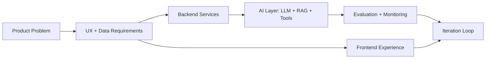

  
  
  

<h1 align="center">Hardik Bhammar</h1>

<h3 align="center">Full-Stack + GenAI Engineer | Building Intelligent Products for 2026 and Beyond</h3>

  

  
  
  
  

  I build complete systems where modern frontend UX, resilient backend architecture, and practical GenAI capabilities work together to create measurable product impact.

  
  
  

---

## 2026 Profile Snapshot

<table align="center">
  <tr>
    <td><strong>Current Focus</strong></td>
    <td>Shipping AI-enabled full-stack products with secure APIs, observability, and production-grade reliability.</td>
  </tr>
  <tr>
    <td><strong>Building Now</strong></td>
    <td>LLM-powered web apps with RAG pipelines, agent workflows, vector search, and business process automation.</td>
  </tr>
  <tr>
    <td><strong>Learning Next</strong></td>
    <td>Advanced multi-agent orchestration, cloud-native MLOps, model evaluation, and inference optimization.</td>
  </tr>
  <tr>
    <td><strong>Open To</strong></td>
    <td>High-impact Full-Stack and GenAI roles, internships, and collaborations in product-focused teams.</td>
  </tr>
  <tr>
    <td><strong>Portfolio</strong></td>
    <td><a id="portfolio-link" href="https://hardikbhammar.dev">hardikbhammar.dev</a></td>
  </tr>
  <tr>
    <td><strong>Fun Fact</strong></td>
    <td>I can go from problem statement to full-stack AI MVP rapidly with clean, maintainable code.</td>
  </tr>
</table>

---

## Next-Gen AI Impact Dashboard

<table align="center">
  <tr>
    <td><strong>AI Mission</strong></td>
    <td>Turn complex workflows into intelligent, user-friendly products powered by practical GenAI.</td>
  </tr>
  <tr>
    <td><strong>Current Architecture Theme</strong></td>
    <td>Agent-ready services with clean API contracts and retrieval-first design.</td>
  </tr>
  <tr>
    <td><strong>Shipping Rhythm</strong></td>
    <td>Rapid prototyping, measurable validation, and production hardening.</td>
  </tr>
  <tr>
    <td><strong>2026 Focus Track</strong></td>
    <td>AI copilots, internal automation tools, and data-rich product platforms.</td>
  </tr>
</table>

---

## AI x Full-Stack Capability Map

| Layer | What I Build | Typical Stack |
|---|---|---|
| AI Layer | RAG systems, prompt workflows, agent tool-calling, chatbot pipelines | Python, OpenAI APIs, Vector DB, LangChain-style patterns |
| API Layer | Secure service architecture, auth, integrations, business logic | Node.js, Express, Django, FastAPI, JWT, REST |
| Frontend Layer | Responsive product UIs with strong DX and performance | React, Next.js, TypeScript, state management |
| Data Layer | Reliable persistence and schema design | MongoDB, PostgreSQL, MySQL, Redis |
| DevOps Layer | Build, deploy, monitor, iterate quickly | Docker, GitHub Actions, AWS, observability mindset |

---

## Tech Arsenal 2026

  

---

## System Thinking (How I Build)

---

## Performance and Coding Metrics

<table align="center">
  <tr>
    <td>LeetCode Ranking</td>
    <td id="leetcode-ranking">N/A</td>
  </tr>
  <tr>
    <td>LeetCode Problems Solved</td>
    <td id="leetcode-solved">N/A</td>
  </tr>
  <tr>
    <td>GitHub Public Repositories</td>
    <td id="github-repos">N/A</td>
  </tr>
  <tr>
    <td>GitHub Followers</td>
    <td id="github-followers">N/A</td>
  </tr>
  <tr>
    <td>Total Repository Stars</td>
    <td id="github-stars">N/A</td>
  </tr>
</table>

  
  

  

---

## Why Teams Work With Me

- End-to-end ownership: I can deliver frontend, backend, database, and AI integration in one unified workflow.
- Product-first engineering: I balance user value, code quality, and shipping speed.
- AI with purpose: I build practical GenAI features that improve real user tasks, not just demos.

---

## Engineering Principles

- Build for reliability first, then optimize for speed.
- Design APIs and prompts as products, not just implementation details.
- Keep models observable with feedback loops, evaluation, and iteration.
- Favor clean developer experience to accelerate team delivery.

---

## Experience Highlights

- Full-Stack Developer Intern: Built Next.js + Express applications with role-based auth and Stripe integration.
- AI Intern (IBM SkillsBuild): Developed NLP chatbot systems and worked on practical AI deployment patterns.
- Delivery Mindset: Focused on reliable architecture, clean UX, and measurable product outcomes.

---

## Featured Builds

- Network Traffic Analyzer: Real-time packet analysis with anomaly detection concepts.
- Buyer\'s Edge: Full-stack e-commerce platform with authentication, payments, and admin controls.
- StudySync: Education platform with recommendation-oriented features.

---

## 2026 Collaboration Note

I am open to building modern products where AI is not a gimmick but a core capability: intelligent assistants, workflow automation, smart dashboards, and developer tools.

---

## Contribution Graph

  

<i>Last updated: 2026-03-13 00:00:00 UTC</i>

